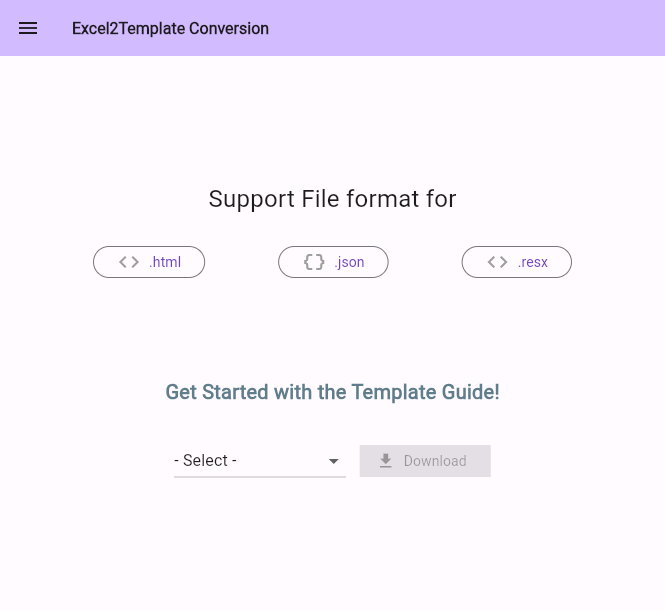

# Flutter Excel Template
> 다국어 프로젝트 시 엑셀 기반인 언어별 번역 문구를 해당 포맷 파일 형식으로 한번에 변환해서 관리

## preview


## Support File Format
- `.html`
  - 엑셀 기반 으로 정리된 번역 문구를 `HTML` 산출물로 자동화 변환
- `.json`
  - 엑셀 기반 으로 정리된 번역 문구를 `JSON` 산출물로 자동화 변환
- `.resx`
  - 엑셀 기반 으로 정리된 번역 문구를 `RESX` 산출물로 자동화 변환 

## Getting Started

This project is a starting point for a Flutter application.

A few resources to get you started if this is your first Flutter project:

- [Lab: Write your first Flutter app](https://docs.flutter.dev/get-started/codelab)
- [Cookbook: Useful Flutter samples](https://docs.flutter.dev/cookbook)

For help getting started with Flutter development, view the
[online documentation](https://docs.flutter.dev/), which offers tutorials,
samples, guidance on mobile development, and a full API reference.

---

### 버전 확인
``` bash
$ /Volumes/workspace/@sdk/flutter-3.16.5/bin/flutter --version
```

### 빌드
``` bash
$ /Volumes/workspace/@sdk/flutter-3.16.5/bin/flutter build macos
$ /Volumes/workspace/@sdk/flutter-3.16.5/bin/flutter build web
```

### 웹 빌드 파일 수정
``` html
<base href="https://{도메인}/exel2template/web/">
```
